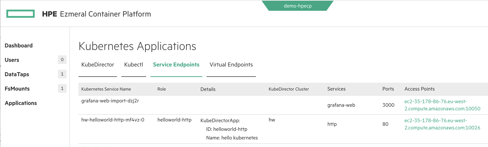

### Overview

This simple KubeDirectorApplication is based on a community docker image that prints

**Hello from hw-helloworld-http-mf4vz-0** (the actual output is the pod hostname)


### Create KubeDirectorApplication

Create the KubeDirectorApplication in this folder with:

```
kubectl -n your-tenant-namespace apply -f https://raw.githubusercontent.com/hpe-container-platform-community/kubedirector-examples/main/01-hello-world/cr-hello-world.json
```

### Create KubeDirectorCluster

You can instantiate an instance of the Application (i.e. create a KubeDirectorCluster), either:

- using the ECP UI


- using kubectl:

```
cat <<EOF | kubectl -n your-tenant-namespace apply -f -
---
apiVersion: "kubedirector.hpe.com/v1beta1"
kind: "KubeDirectorCluster"
metadata: 
  name: "hw"
  namespace: "non-mlops"
  labels: 
    description: "hw"
spec: 
  app: "helloworld-http"
  namingScheme: "CrNameRole"
  appCatalog: "local"
  connections: 
    secrets: []
  roles: 
    - 
      id: "helloworld-http"
      members: 1
      resources: 
        requests: 
          cpu: "2"
          memory: "4Gi"
          nvidia.com/gpu: "0"
        limits: 
          cpu: "2"
          memory: "4Gi"
          nvidia.com/gpu: "0"
EOF
```

### Access Service Endpoints

Navigate to service endpoints and click the endpoint for the helloworld-http cluster:



You should see an output like:

**Hello from hw-helloworld-http-mf4vz-0**

### Exercise

Try creating an cluster with more than one node.  Access the service endpoints.  What do you see?
