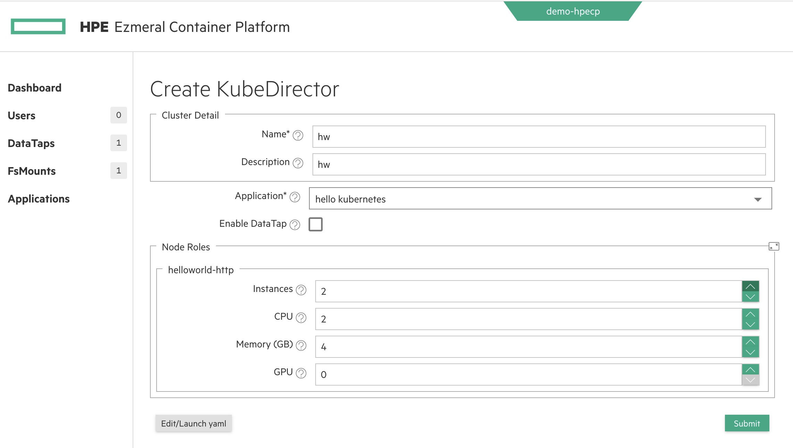

### Introduction

Apply this KubeDirectorApplication with:

```
kubectl -n your-tenant-namespace apply -f https://raw.githubusercontent.com/hpe-container-platform-community/kubedirector-examples/main/01-hello-world/cr-hello-world.json
```

You can then instantiate an instance of the Application (i.e. create a KubeDirectorCluster), either:

- using the ECP UI




- using kubectl:

```
cat <<EOF | kubectl -n your-tenant-namespace apply -f -
---
apiVersion: "kubedirector.hpe.com/v1beta1"
kind: "KubeDirectorCluster"
metadata: 
  name: "hw"
  namespace: "non-mlops"
  labels: 
    description: "hw"
spec: 
  app: "helloworld-http"
  namingScheme: "CrNameRole"
  appCatalog: "local"
  connections: 
    secrets: []
  roles: 
    - 
      id: "helloworld-http"
      members: 1
      resources: 
        requests: 
          cpu: "2"
          memory: "4Gi"
          nvidia.com/gpu: "0"
        limits: 
          cpu: "2"
          memory: "4Gi"
          nvidia.com/gpu: "0"
EOF
